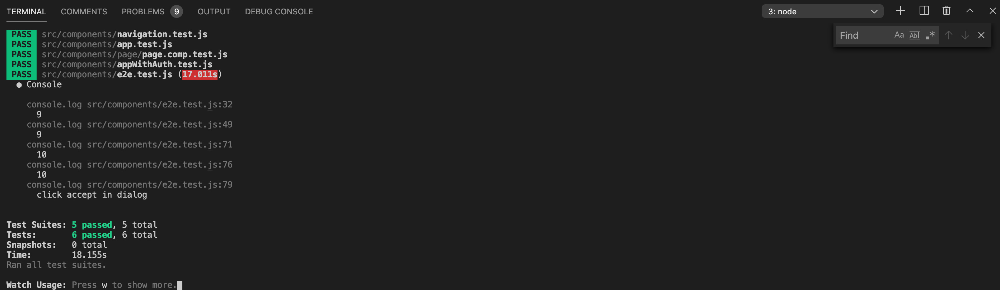
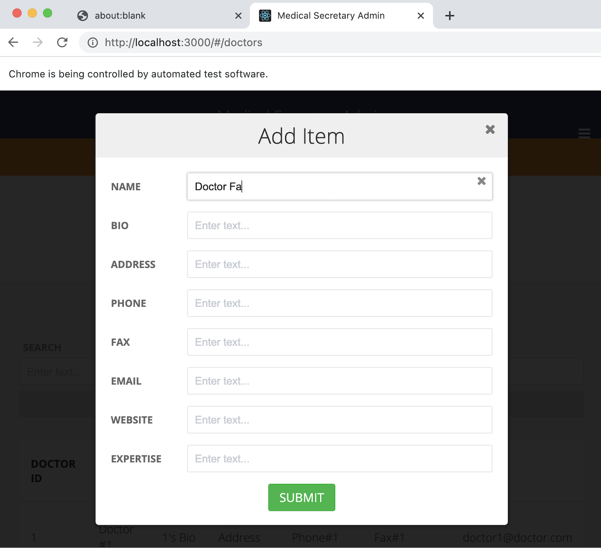

# Front-End UI Tool

## 2. Testing

### 2.1 Setup
The front-end test automation is done using [React Testing Library](https://testing-library.com/docs/react-testing-library/intro) and [Puppeteer](https://github.com/puppeteer/puppeteer/blob/v5.4.0/docs/api.md#pageclickselector-options).

Run `npm install` to install all the dependencies.


To install React Testing Library: <br>
`npm install --save-dev @testing-library/react`

To install Puppeteer: <br>
`npm install --save-dev puppeteer`

### 2.2 Run Test

> **Notes**: <br>
> The front-end UI `App` component is wrapped inside `AmplifyAuthenticator` within `AppWithAuth` component to provide authentication service to the front-end. Automating the process of amplify sign-in is not allow through Puppeteer because `AmplifyAuthenticator` components are with shadow-dom. <br>

In order to run end-to-end test, we need our front-end to render only the `App` component without authentication. Make the following change in *src/index.tsx*:

``` js
// ReactDOM.render(<AppWithAuth />, document.getElementById('root'));
ReactDOM.render(<App />, document.getElementById('root'));
```

In deployment, change the code back to rendering `AppWithAuth` instead of `App` in *src/index.tsx*:

``` js
// ReactDOM.render(<App />, document.getElementById('root'));
ReactDOM.render(<AppWithAuth />, document.getElementById('root'));
```

### 2.2.1 Steps
In terminal, run `npm start` to set up the development environment and start a server with address 'localhost:3000'.

Then in another terminal, run `npm test`. All the `*.test.js` files will be run.

Testing includes multiple Component tests to check if react components are correctly rendered on screen, and end-to-end UI automation tests to mock user interactions in a browser.

End-to-end test code are stored in *src/components/e2e.test.js*. It will open two Chromium browsers, and automate the following steps:

- open front-end in puppeteer browser → create a new page and navigate to 'http://localhost:3000/'
- count the number of table item
- click on ‘add item’ → type name, etc. → click on ’submit' to update data.
- Open another browswer → click on 'delete' in a table row → "accept delete action in popped up dialog".




